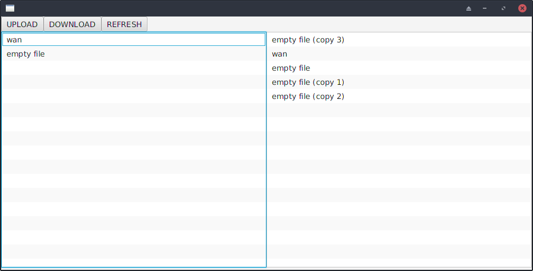

# File Share
## CSCI2020U Assignment 2
## By: Mathew Kasbarian & Alec Tozak

This application allows for a user to upload and download files from a server. It is split into two parts, the client and server which are each in their own directories.

## How to run:
- Open both parts (server and client) of the project individually using your prefered IDE
- If needed you may change the port the server listens to by changing the "SERVER_PORT" variable in "Main.java" of the server
- Ensure that the "SERVER_PORT" and "SERVER_HOST" in the client "Main.java" file are correct (the client and server port must match)
- If desired you can change the shared folder for both the client and server by changing the corresponding "FILES_DIRECTORY" variable (ensure the directory exists)
- Run the server first, it should state it has started in the console
- After the server is running you may run the client

## Resources Used:
This project references part of the ChatServer example used in class for multithreading  
https://learn.ontariotechu.ca/courses/11612/pages/module-7-multithreading-videos?module_item_id=298626
